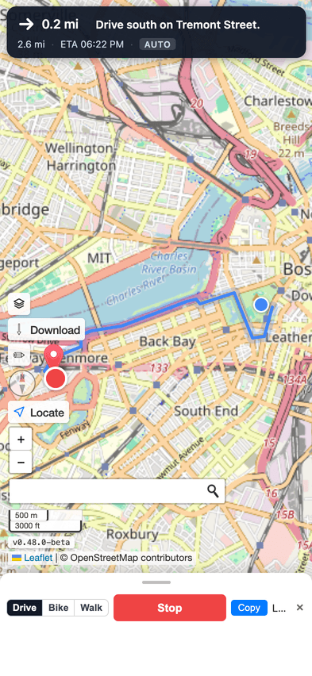
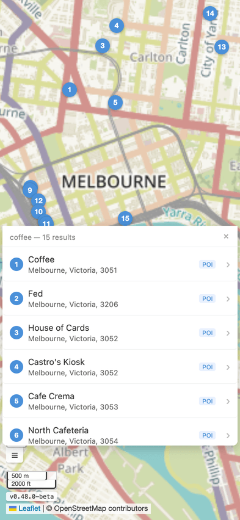
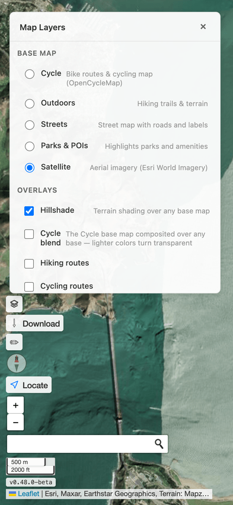
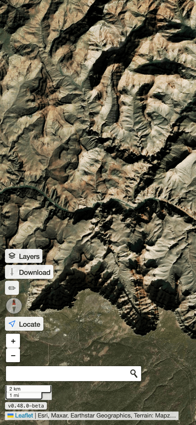
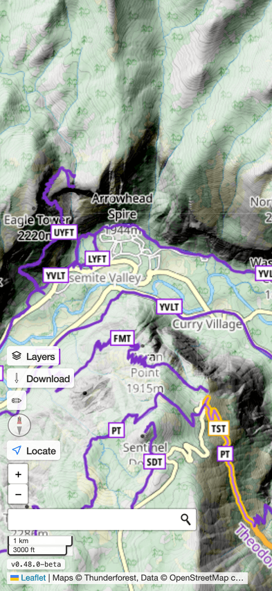
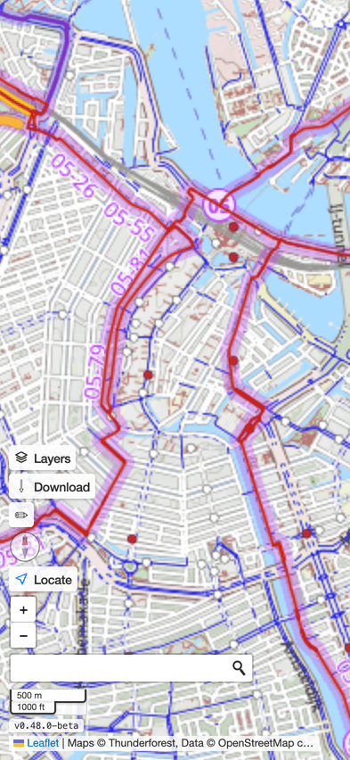

# webmap.dev

[](https://github.com/jasoneplumb/webmap.dev/actions/workflows/ci.yml)
[](https://opensource.org/licenses/MIT)


> A mobile-first Progressive Web App for live GPS navigation and offline map exploration.

## Preview

<p align="center">
  
  
  
</p>

<p align="center">
  
  
  
</p>

<p align="center">
  <em>Try it live at <a href="https://www.webmap.dev">webmap.dev</a></em>
</p>

## Features

- **Live GPS Tracking** — Blue dot with accuracy circle and translucent heading-cone wedge that points in the GPS course; three-state locate button (off / active-following / passive)
- **Turn-by-Turn Navigation** — Tap "Navigate here" on any search result or dropped pin to fetch a route from FOSSGIS Valhalla (driving / cycling / walking) with maneuver pill, ETA, off-route recalculation, and arrival detection
- **Device-Orientation Compass** — Top-right compass rose that rotates so true north stays up while the device is moved (iOS-13+ permission gate handled)
- **Address Search** — Find places using ESRI ArcGIS geocoding with autocomplete, numbered result markers, and a "Navigate here" action
- **Reverse Geocoding** — Double-click or long-press to drop a pin and look up the address; bottom geocode bar exposes Copy and Navigate actions
- **Layer Switching** — Custom popover for base maps (Cycle, Outdoors, Streets, Parks &amp; POIs, Satellite) and independent overlays: client-side hillshade, Cycle blend, Waymarked hiking and cycling routes, CyclOSM bike infrastructure, and GeoJSON files from your own device
- **Offline Support** — OSM tiles cached via service worker (StaleWhileRevalidate, 30 days, 500 entries) plus proactive region pre-download into the Cache API
- **Background-GPS Keepalive** — Wake Lock + silent-audio loop while navigating so iOS Safari keeps GPS fixes flowing with the screen off
- **Adaptive GPS Accuracy** — Automatically downgrades to coarse fixes after 5 stationary samples and restores high-accuracy on movement to save battery
- **Consent Dialog** — First-run privacy / terms modal with sticky header and footer; consent version forces re-acceptance when third-party services change
- **Changelog** — Tap the version badge in the bottom-left cluster to read the full release history inline
- **Adaptive Controls** — Locate, Layers, and Download buttons collapse to icon-only after first use, with collapse persisted to `localStorage`

## Design Principles

- **Offline-first** — Map tiles, app code, and reverse-geocode results survive without connectivity; routing requires the user's explicit "Navigate here" tap
- **Local-only by default** — No accounts, no telemetry, no server storage; the only outbound traffic is tiles, ESRI geocoding, and Valhalla routing on user action ([ADR-004](docs/adr/ADR-004-local-only-data.md), [ADR-006](docs/adr/ADR-006-routed-guidance.md))
- **Progressive enhancement** — Search and routing degrade to clear error toasts when offline; reverse geocoding is silenced
- **Mobile-native UX** — Bottom sheets, peek-state geocode bar, safe-area insets, and a thumb-reach bottom-left control cluster
- **Minimal dependencies** — No framework, no CSS library, no state management — Leaflet, esri-leaflet, esri-leaflet-geocoder, and a single mutable `AppState`
- **Transparent architecture** — One `AppState` object threaded by reference through every module ([ADR-001](docs/adr/ADR-001-single-mutable-state.md))

## Tech Stack

| Layer | Technology |
|-------|------------|
| **Build** | Vite 5 + TypeScript ES2020 (strict, `noUncheckedIndexedAccess`) |
| **Map** | Leaflet 1.9 + esri-leaflet 3 + esri-leaflet-geocoder 3 |
| **Tiles** | Free OSM-derived: CyclOSM, OpenStreetMap, OpenTopoMap, Humanitarian; Esri hillshade overlay |
| **Geocoding** | ESRI ArcGIS (forward + reverse) |
| **Routing** | FOSSGIS Valhalla — single endpoint serves `auto`, `pedestrian`, and `bicycle` |
| **Offline** | Workbox 7 (StaleWhileRevalidate for OSM tiles) + Cache API (proactive region pre-download) |
| **PWA** | vite-plugin-pwa (manifest, install prompts, maskable icons) |
| **Tests** | vitest (pure-function unit tests for `geo`, `routing`, `guidance`, `geocoding`, `location`, `orientation`, `bottom-sheet`) |
| **Server** | nginx (HSTS, SPA fallback, 1-year asset cache, never-cache HTML) |
| **CI/CD** | GitHub Actions — `npm test` on every push / PR; deploy on push to `mainline` |

## Getting Started

### Prerequisites

- **Node.js** 22 or later (matches the GitHub Actions runner)
- **ESRI API key** (required for address search and reverse geocoding)

### Installation

```bash
git clone https://github.com/jasoneplumb/webmap.dev.git
cd webmap.dev
npm install
```

### Environment Variables

Create a `.env` file in the project root:

```
VITE_ESRI_API_KEY=AAPKd...     # Required: get from arcgis.com/sharing/rest
```

Without the ESRI key the search control is skipped at startup (no broken UI), and reverse geocoding silently returns coordinates only.

### Development

```bash
npm run dev          # Dev server at http://localhost:5173
npm run build        # Production build → dist/
npm run preview      # Preview production build
npm run type-check   # TypeScript validation
npm run lint         # ESLint
npm test             # Run unit tests
npm run size         # size-limit check (≤103 kB gzipped)
npm run og           # Regenerate the social-preview OG image
npm run icons        # Regenerate maskable PWA icons
npm run screenshots  # Regenerate the preview screenshots in docs/images/
```

## Architecture

webmap.dev uses a **single shared AppState object** threaded through all modules. No event bus, no Redux, no observable graph — just a mutable state object passed by reference. GPS polling is shared between the locate button and turn-by-turn guidance through an integer **refcount** so each consumer can request and release the watch without stepping on the other.

See **[docs/architecture.md](docs/architecture.md)** for a deep-dive on:

1. Single Shared State (`types.ts`)
2. GPS Polling Refcount (`timer.ts` + `main.ts`)
3. Three-State Locate Button
4. Haversine Jitter Filter + Heading-Cone Wedge
5. Routed-Guidance State Machine (`guidance.ts` + `routing.ts`)
6. Device-Orientation Compass (`compass.ts` + `orientation.ts`)
7. Background-GPS Keepalive (`keepalive.ts`)
8. Bottom Sheet / Side Panel (iOS Safari `offsetHeight` trick — [ADR-003](docs/adr/ADR-003-offsetheight-ios-safari.md))
9. Consent Modal with sticky header/footer
10. Layers Control (custom popover) + Adaptive Control Labels
11. Offline Tile Strategy (passive Workbox + proactive Cache API — [ADR-005](docs/adr/ADR-005-offline-tile-strategy.md))
12. nginx Infrastructure

## Project Structure

```
src/
  main.ts              # Entry point — wires modules; owns the GPS polling refcount and toast
  types.ts             # AppState interface + GuidanceState; createInitialState()
  map.ts               # Leaflet init; OSM/CyclOSM/OpenTopo/Humanitarian + Esri hillshade; offline tile fallback
  controls.ts          # Toggle button factory; three-state locate icon; setupCollapsibleLabel helper
  geocoding.ts         # ESRI search dropdown + reverse-geocode bar; "Navigate here" entry to guidance
  location.ts          # GPS handler — haversine filter, blue-dot, heading wedge, weak-signal hysteresis, adaptive accuracy
  timer.ts             # map.locate({ watch }) wrapper with high/low-accuracy switching
  guidance.ts          # Routed-guidance state machine + bottom-left pill UI (idle → routing → guiding ↔ off-route → arrived)
  routing.ts           # FOSSGIS Valhalla client + polyline6 decoder; Costing/Route/RouteStep types
  geo.ts               # Pure helpers: haversineDistance, bearingDeg, pointToSegmentMeters
  compass.ts           # Top-right compass rose driven by --heading-deg CSS custom property
  orientation.ts       # DeviceOrientationEvent wrapper + iOS-13+ permission gate
  keepalive.ts         # Wake Lock + silent-audio loop for background GPS during navigation
  layers-control.ts    # Custom base-map / overlay popover with localStorage persistence
  offline-download.ts  # Region pre-download UI; parallel tile fetch into the Cache API
  bottom-sheet.ts      # Mobile bottom sheet (snap points, drag) + desktop side panel
  battery.ts           # Battery API monitoring; populates state.batteryLevel/Charging
  consent.ts           # First-run consent modal; CONSENT_VERSION gating
  sw-constants.ts      # Shared service-worker cache name (vite.config.ts + map.ts)
  style.css            # All app styles
  *.test.ts            # vitest unit tests for the pure modules
  esri-leaflet-geocoder.d.ts  # local type stub for the geocoder package

infrastructure/
  nginx/
    www.webmap.dev.conf  # HSTS, SPA fallback, asset caching, gzip, security headers

docs/
  architecture.md      # Architectural deep-dive
  features.md          # Feature reference and known limitations
  development.md       # Setup, conventions, debugging
  deployment.md        # CI/CD pipeline, nginx config, rollback
  adr/                 # Architecture Decision Records (ADR-001 … ADR-006)
  images/              # Screenshots used in this README

scripts/                # generate-og-image.mjs, generate-maskable-icons.mjs, capture-screenshots.mjs
vite.config.ts          # PWA manifest + Workbox runtime caching
package.json            # Dependencies, scripts, version, size-limit budget
CLAUDE.md               # Project conventions for AI-assisted development
```

## Contributing

See [CONTRIBUTING.md](CONTRIBUTING.md) for setup, code conventions, and the PR workflow.

## License

See `LICENSE` (MIT).
